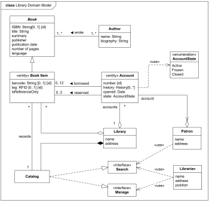

-  A **model** is literally the model for an entity in our application.
-  Using Entity Framework (ORM), every **model** will be translated to a **database table**.
# Practice:
-  **Important**: Create a folder in the project specifically to agreggate the **models**.
-  Considering this bookstore UML diagram, let's create the *main* models (Book and Author):



## Book

```
    public class Book
    {
        public int Id { get; set; }
        public string ISPN { get; set; }
        public string Title { get; set; }
        public string Sinopsis { get; set; }
        public string Publisher { get; set; }
        public DateTime PublishedDate { get; set; }
        public int PageNumber { get; set; }
        public string LanguageIsoCode { get; set; }
    }
```


## Author

```
 public class Author
 {
     public int Id { get; set; }
     public string Name { get; set; }
 }
```


## Relationships

-  One-to-one
-  One-to-many
-  Many-to-many

<br>

-  Considering that, in our ptoject, an Author can have a lot of books, but a Book has an Author,
	-  it is a ***one-to-many* relationship
	-  these properties must be added to the models:

**Author**:
`public ICollection<Book> Books { get; set; }`

**Book**:
`public Author Author { get; set; }`
